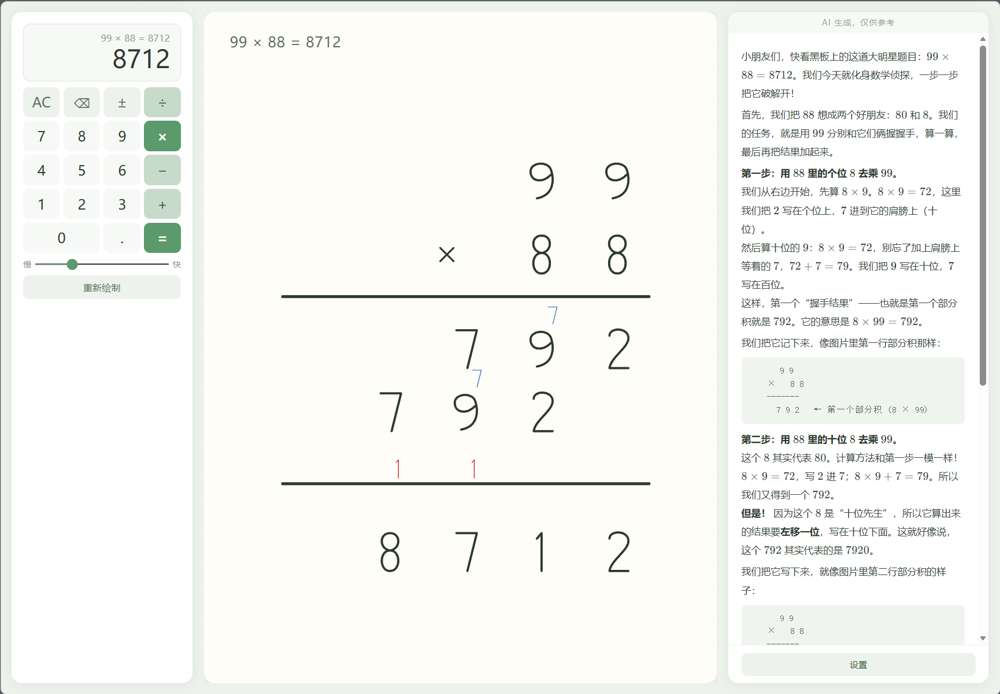

# 竖式计算器

一个带有手写动画效果的竖式计算器，支持加减乘除四则运算，可选 AI 讲解功能。



## 功能概览

- 竖式计算 SVG 手写动画（逐笔书写效果）
- 计算器键盘输入 + 键盘快捷键
- 可调节动画速度 + 重绘功能
- AI 讲解面板（支持多模态大模型）
- Markdown + LaTeX 公式渲染

## 技术栈

| 技术 | 用途 |
|------|------|
| HTML5 / CSS3 | 页面结构与样式 |
| SVG | 竖式数字路径绘制与动画 |
| 原生 JavaScript | 全部逻辑，无框架依赖 |
| KaTeX 0.16.33 | 数学公式渲染（CDN 加载） |
| OpenAI 兼容 API | AI 讲解（支持任意兼容接口） |

## 使用方法

1. 直接用浏览器打开 `index.html` 即可使用
2. 输入第一个数 → 选择运算符 → 输入第二个数 → 按 `=`
3. 竖式动画播放完成后显示结果
4. 调节速度滑块改变动画快慢
5. 点击「重新绘制」以当前速度重放动画

### AI 讲解设置

1. 点击右下角「设置」按钮
2. 填写 API URL（如 `https://api.xiaomimimo.com/v1`）、API Key、模型 ID
3. 勾选「启用 AI 讲解」
4. 可选勾选「多模态」发送竖式图片给模型

### 键盘快捷键

| 按键 | 功能 |
|------|------|
| `0-9` | 输入数字 |
| `.` | 小数点 |
| `+` `-` `*` `/` | 运算符 |
| `Enter` 或 `=` | 计算 |
| `Backspace` | 退格 |
| `Escape` / `Delete` | 清除（AC） |

## 能力边界

### 输入限制

| 限制项 | 值 |
|--------|----|
| 整数部分位数 | 最多 4 位 |
| 小数部分位数 | 最多 3 位 |
| 数值范围 | 绝对值 ≤ 9999（如 12.345、-9999） |

### 四则运算支持

| 运算 | 整数 | 小数 | 负数 | 说明 |
|------|:----:|:----:|:----:|------|
| 加法 | ✅ | ✅ | ⚠️ | 负数参与加法时竖式按绝对值绘制 |
| 减法 | ✅ | ✅ | ⚠️ | 负数结果会显示负号，竖式按大减小绘制 |
| 乘法 | ✅ | ✅ | ⚠️ | 负号在表达式和结果中显示，竖式按绝对值绘制 |
| 除法 | ✅ | ⚠️ | ⚠️ | 结果以 `商......余数` 格式显示 |

### 除法详细说明

- 结果以**商和余数**形式展示（如 `7 ÷ 3 = 2......1`）
- 余数用 6 个点 `......` 分隔
- 除数为整数时支持被除数为小数
- 除数含小数时，自动将两者放大为整数后计算（如 `1.2 ÷ 0.3` → `12 ÷ 3`）
- 不支持除数为 0
- 结果不进行小数除法（不做循环小数展开）

### 动画特性

- 数字按手写笔画动画逐步书写
- 进位标记：红色（加法/最终结果）、蓝色（乘法中间步骤）
- 借位标记：红色圆点
- 小数末尾多余的零会被划掉
- 最高位为纯进位时，先写最高位再依次写低位

### 计算结果范围

- 乘法结果可能超过 9999（如 `9999 × 9999`），竖式绘制不受位数限制
- JavaScript 浮点精度限制：乘法使用整数运算避免误差，加减法用 `toFixed(6)` 处理

## 已知限制

1. **负数竖式**：竖式动画始终按绝对值绘制，不显示操作数的负号。负号仅在表达式和结果中体现
2. **除法小数**：只支持整数除法（带余数），不进行小数展开
3. **AI 响应**：依赖外部 API，网络或模型问题会导致讲解失败

## 文件结构

```
草稿计算器/
├── index.html              入口页面
├── assets/
│   └── example.png         演示截图
├── css/
│   └── style.css           全部样式
└── js/
    ├── digits.js           数字和符号的 SVG 路径常量
    ├── svg-draw.js         SVG 绘制原语（笔画、线条、圆点等）
    ├── svg-utils.js        工具函数（数字对齐、前导零跳过、末尾零划除）
    ├── render.js           Markdown + KaTeX 渲染器
    ├── settings.js         AI 设置面板 & SVG 截图
    ├── ai-explain.js       AI 并行请求（与动画同时发起）
    ├── vertical-calc.js    四则运算竖式构建（核心算法）
    ├── anim.js             动画引擎
    └── calculator.js       计算器状态机 & 事件处理
```

## 待改进

- [ ] 除法支持小数商（循环小数展开）
- [ ] 负数在竖式中的完整视觉表现
- [ ] 更多位数支持（当前输入限制 4 位整数）
- [ ] 本地化数学字体（KaTeX 字体离线化）
- [ ] 讲解面板支持流式输出（SSE）
- [ ] 移动端响应式布局
- [ ] 测试用例覆盖

## License

[MIT](LICENSE)
